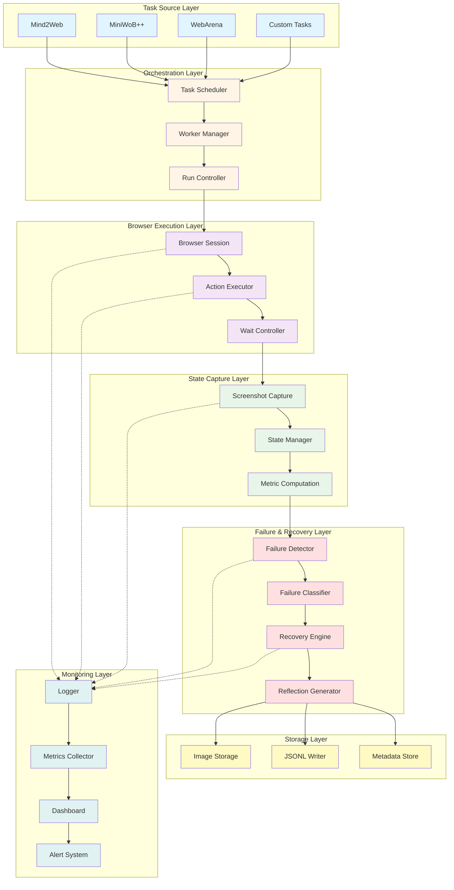
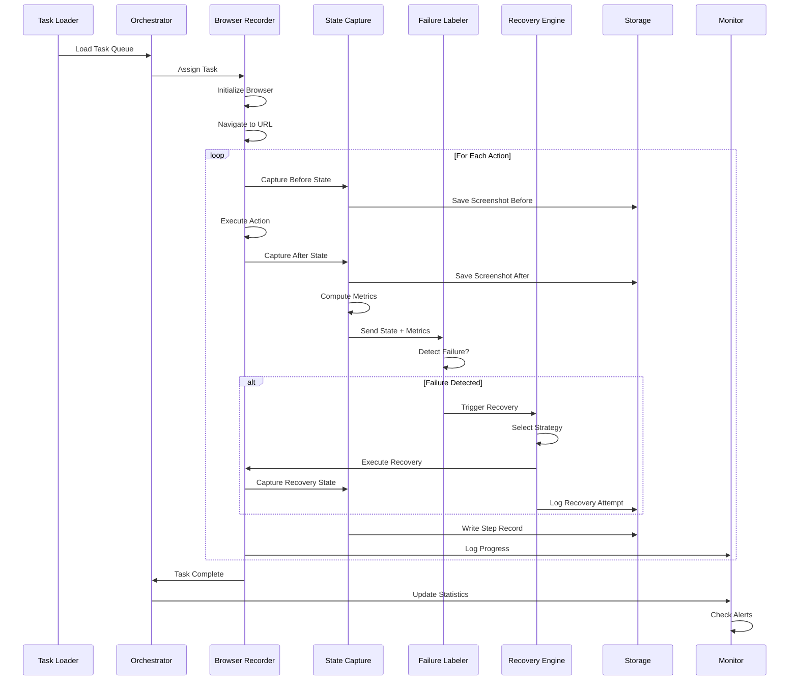
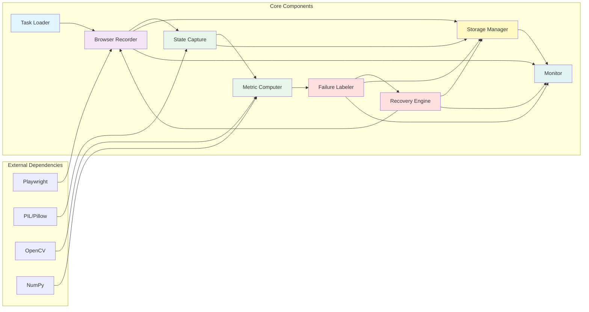
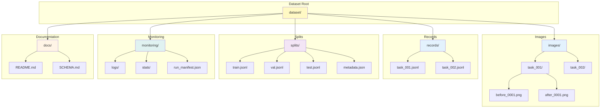
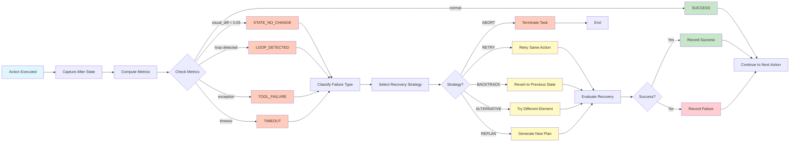
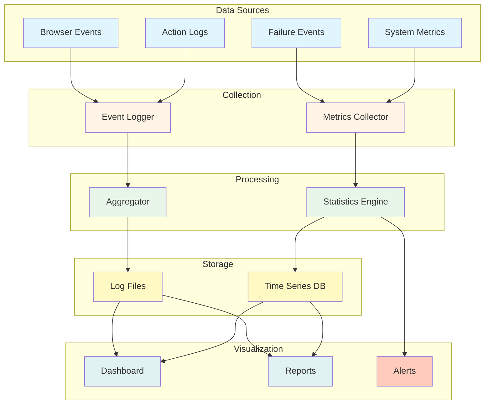
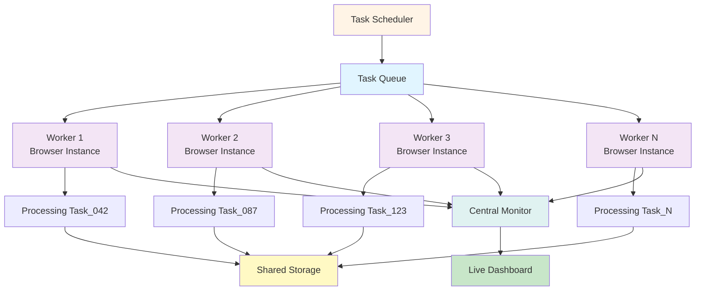
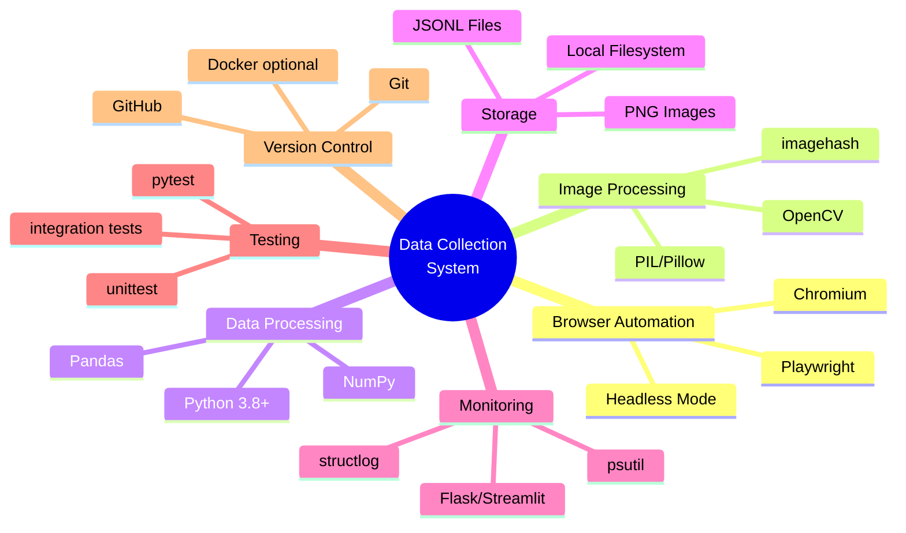

# Data Collection Architecture Diagram

**Project:** Failure-Aware Web Interaction Trajectory Dataset  
**Last Updated:** February 19, 2026

---

## 1. High-Level System Architecture

---

## 2. Detailed Data Flow

---

## 3. Component Dependencies

---

## 4. Storage Architecture

---

## 5. Failure Detection & Recovery Pipeline

---

## 6. Monitoring & Observability Flow

---

## 7. Parallel Worker Architecture

---

## 8. Technology Stack

---

## Notes

- **Modularity**: Each layer is independently testable
- **Scalability**: Parallel workers can be added easily
- **Observability**: Comprehensive logging and monitoring
- **Reproducibility**: Git commit tracking and environment snapshots
- **Extensibility**: Easy to add new task sources or recovery strategies

---

**Architecture Version:** 1.0  
**Compatible with:** Project Plan v1.0  
**Last Review:** February 19, 2026
